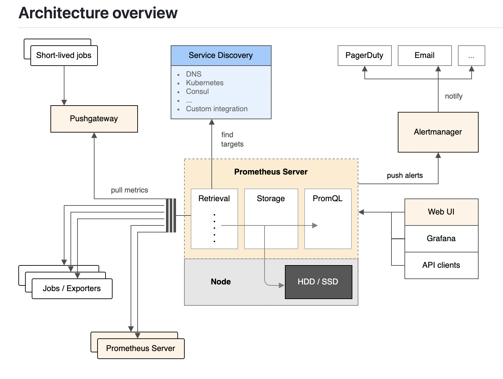
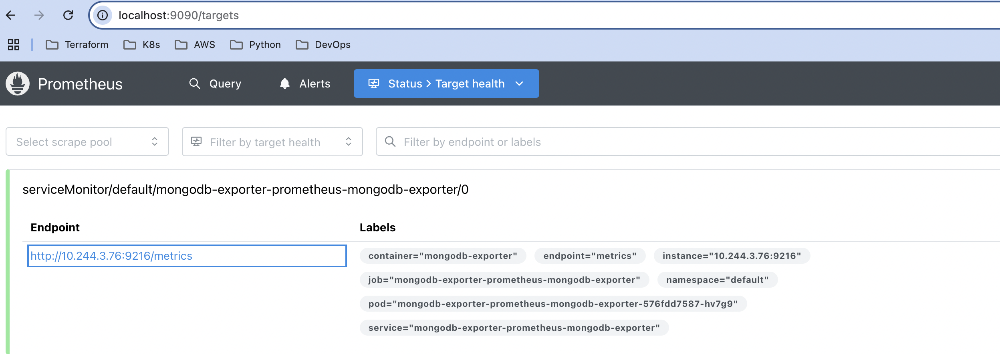
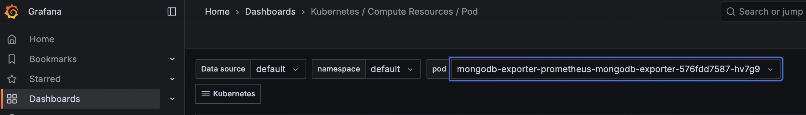

## Prometheus ##
This is repo is all about monitoring the alerts, metrics and grafana  visualization

# Prerequesites #

1. Install kubernetes cluster in your local system i.e Minikube, Kind or EKS in AWS etc. i.e (It requires docker install accordingly)

2. Installed Minikube in my local system which requires docker driver, so before installing minkube install docker in your respective systems or OS.

Reference Link for minikube install: https://minikube.sigs.k8s.io/docs/start/?arch=%2Fmacos%2Farm64%2Fstable%2Fbinary+download

3. After installing start the command called `minikube start` it will start the minikube cluster

4. Check status minikube status

5. Install helm i.e (Helm 3) 

6. kubectl access i.e (kubernetes command line access to intercat with kubernetes)

`What is Prometheus?`

Prometheus is an open-source monitoring and alerting system, designed for reliability, scalability, and dimensional data collection via pull-based metrics scraping.

`Architecture of Prometheus`



`🔧 Architecture Components (with Kubernetes Integration)`

1. Prometheus Server

The core of the architecture.

Key Functions:

✅ `Retrieval`: Prometheus pulls (scrapes) metrics from targets.

✅ `Storage`: Stores time-series data locally (on HDD/SSD).

✅ `PromQL`: Used for querying stored metrics.

In Kubernetes: The Prometheus Server runs as a pod, typically deployed via the Prometheus Operator or Helm chart. It uses Kubernetes service discovery to automatically find pods, services, and nodes to scrape.

2. Service Discovery

Automatically identifies targets (e.g., exporters) for metric scraping.

Kubernetes-Specific Integration:

✅ Prometheus discovers services, pods, nodes, and endpoints using Kubernetes APIs.

Common target types:

✅ /metrics endpoints exposed by pods.

✅ Node exporters running on each node.

✅ Kube-state-metrics for cluster state metrics.

Configuration is often handled via annotations like:

```bash
prometheus.io/scrape: "true"
prometheus.io/port: "8080"
```

3. Jobs / Exporters

Exporters expose metrics in Prometheus format.

In Kubernetes, you’ll typically deploy:

✅ Node Exporter (for node metrics)

✅ Kube-State-Metrics (for cluster state like deployments, nodes)

✅ cAdvisor (for container metrics)

✅ Custom app exporters (instrumented apps)

4. Pushgateway

✅ Used for short-lived batch jobs that can’t be scraped.

✅ In Kubernetes: You can run the Pushgateway as a service. Short-lived jobs (e.g., Kubernetes CronJobs) push their metrics to it.

5. Alertmanager

✅ Receives alerts from Prometheus.

✅ Sends notifications via PagerDuty, Email, Slack, etc.

✅ Runs as a pod in Kubernetes and is integrated with Prometheus via configuration.

6. Web UI, Grafana, API Clients

✅ Used to visualize and query metrics.

✅ Grafana is commonly deployed as a pod, configured to use Prometheus as a data source

`🔄 Flow in a Kubernetes Cluster`

Prometheus is deployed in the cluster.

✅ It uses the Kubernetes API to discover services/pods with appropriate annotations.

✅ It scrapes metrics from endpoints (e.g., /metrics).

✅ Stores metrics on local storage.

✅ Pushgateway accepts metrics from short-lived jobs.

✅ Alertmanager receives alerts and forwards notifications.

✅ Users query data via PromQL from the web UI or Grafana dashboards.

## Monitoring with Prometheus, Grafana & MongoDB Exporter in Kubernetes ##


🚀 Setup Prometheus & Grafana 

1. Add Helm Repository

```bash
helm repo add prometheus-community https://prometheus-community.github.io/helm-charts
helm repo update
```

2. Install Prometheus Stack via Helm

```bash
helm install [RELEASE_NAME] prometheus-community/kube-prometheus-stack i.e [RELEASE_NAME]= Prometheus
```
This installs:

Prometheus + Operator

Grafana

Node Exporter

Alertmanager

3. Explore Deployed Resources

kubectl get pods,svc,cm,secret -n default | grep prometheus

📺 Access Dashboards

4. Port Forward Grafana UI

✅ kubectl port-forward deploy/prometheus-grafana 3000:3000

Access: http://localhost:3000

Login details are by default providing prometheus. If you want to cutsomize username and password we can acheive.

✅ Username: admin

✅ Password: prom-operator (default, or check secret)

5. Access Prometheus UI

✅ kubectl port-forward svc/prometheus-kube-prometheus-prometheus 9090

Access: http://localhost:9090

# 🛠️ Deploy & Monitor a Sample Application #

6. Deploy MongoDB Without Exporter

kubectl apply -f mongodb-without-exporter.yaml

`Note:` This deploys MongoDB but does not expose metrics yet.

# Install MongoDB Exporter #

7. View Exporter Defaults

helm show values prometheus-community/prometheus-mongodb-exporter > values.yaml

8. Customize values.yaml --> prometheus/values.yaml file

9. Install Exporter with Custom Values

helm install mongodb-exporter prometheus-community/prometheus-mongodb-exporter -f values.yaml

10. Verify Installation

kubectl get pods,svc,servicemonitor -l app.kubernetes.io/name=mongodb-exporter

# 📡 How ServiceMonitor Works #

✅ Prometheus Operator automatically watches ServiceMonitors with label release: prometheus.

✅ ServiceMonitor selects a Service by matching metadata.labels.

✅ It scrapes metrics from /metrics endpoint (defaults to port 9216 for MongoDB exporter).

✅ Those metrics get visualized in `Prometheus and Grafana`.

# Test MongoDB Exporter Manually #

kubectl port-forward svc/mongodb-exporter-prometheus-mongodb-exporter 9216

Access in browser or curl:

curl http://localhost:9216/metrics

Confirms exporter is working and exposing metrics

📊 Check in Prometheus

Visit Prometheus → Status > Target health

Look for `mongodb servicemonitor` for prometheus

Ensure status is `UP` and added the reference screenshot.



📈 Check in Grafana

Go to http://localhost:3000

Click on Dashboards --> Kubernetes / Compute Resources / Pod --> default namepscae --> check mongodb deployments, pods etc.

Added reference Scrennshot:



`Reference Link to Chart:`        https://github.com/prometheus-community/helm-charts/tree/main/charts/kube-prometheus-stack

`Reference to Mongodb Exporter:`  https://github.com/prometheus-community/helm-charts/tree/main/charts/prometheus-mongodb-exporter

`Prometheus Links to Learn:`      https://github.com/warpnet/awesome-prometheus